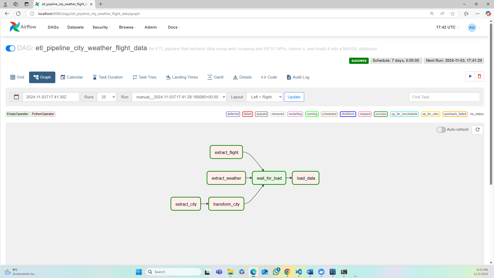
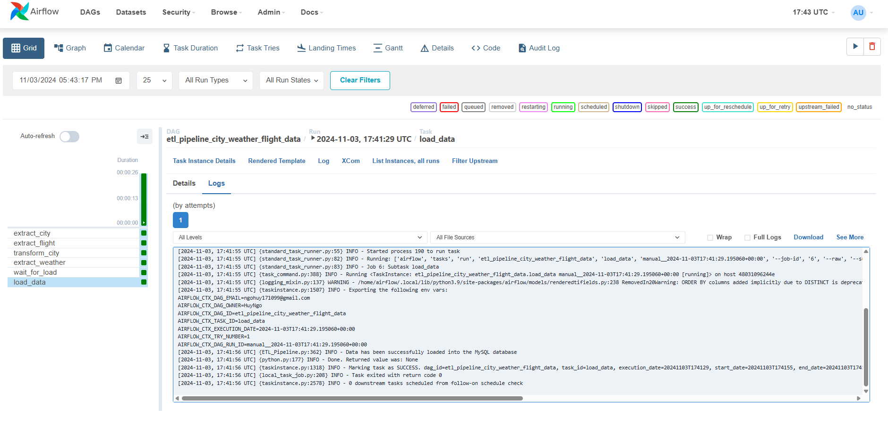
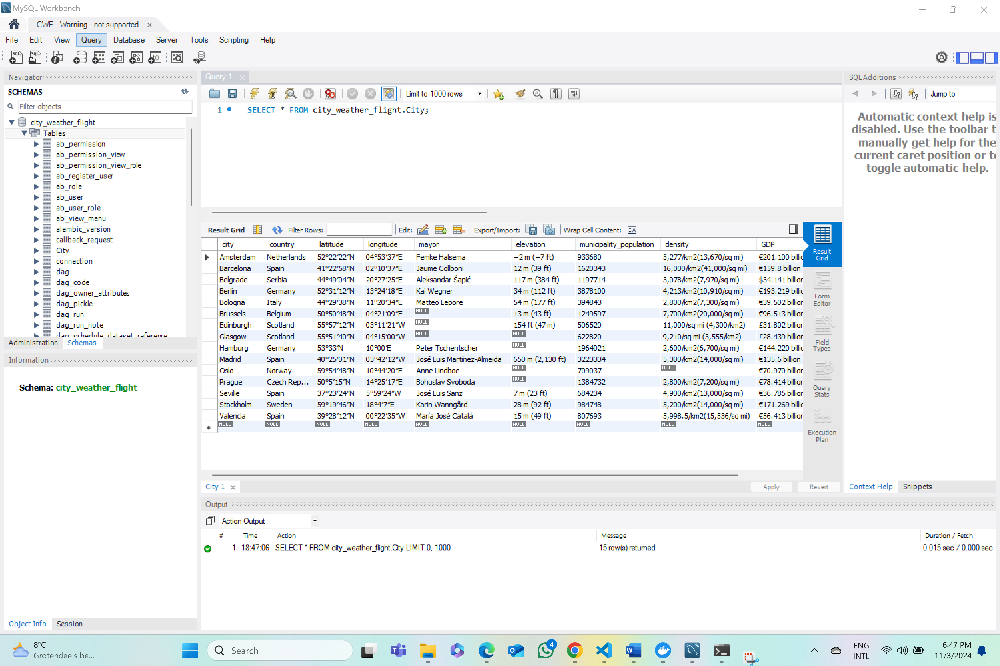
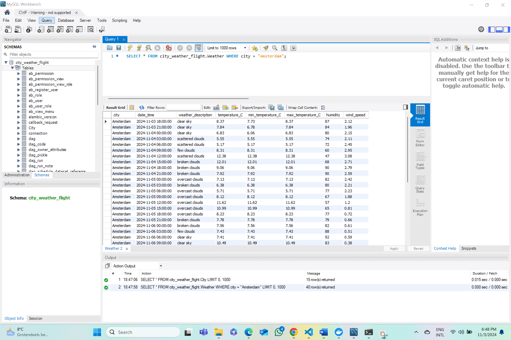
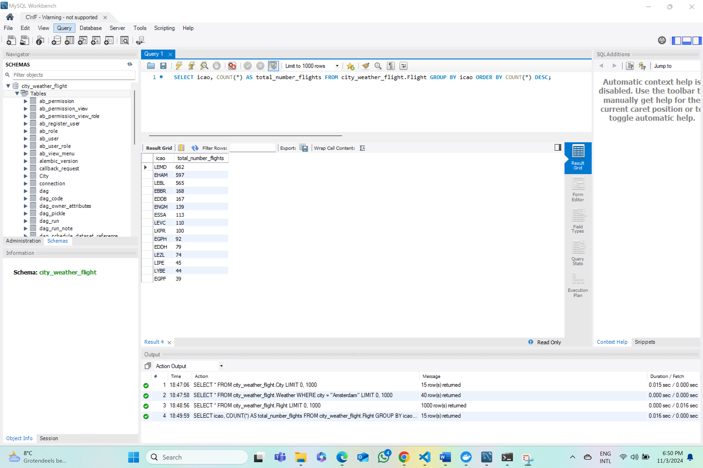

# Travel Agency: City Information, Weather Forecast, and Flight Schedule

## Project Overview

This project involves creating an ETL pipeline to gather relevant city information, weather forecasts, and flight schedules for potential travel destinations. Designed for a travel agency use case, the pipeline enables a streamlined, data-driven approach to help clients select their destination based on critical factors like weather condition and airport congestion.

## Tools and Languages

- **Tools**: Docker Compose, Apache Airflow, MySQL (Workbench), REST APIs, BeautifulSoup
- **Languages**: Python and SQL

## Key Tasks

- **Weather Data**: Extracted 5-day weather forecasts at 3-hour intervals for 15 cities using the **OpenWeatherMap API**.
- **Flight Data**: Gathered arrival schedules for the next 12 hours from international airports in each city via the **Rapid API**.
- **City Data**: Scraped social, economic, and geographical information from each city's **Wikipedia** page using **BeautifulSoup**.
- **Data Transformation**: Applied **Python**-based transformations to clean and prepare data, including removal of references from Wikipedia data and conversion of numeric data.
- **Data Loading**: Stored all data into a **MySQL** database with three entities: City, Weather, and Flight. Additionally, data exports are saved as CSV files on the local machine.
- **Workflow Management**: Coordinated the entire ETL pipeline using **Apache Airflow**, ensuring reliable data extraction, transformation, and loading.
- **Containerization**: Containerized the project using **Docker (Compose)** for production deployments.

## Running The Project

### Prerequisites

- Docker Desktop and Docker Compose installed
- MySQL and MySQL Workbench installed
- Python 3.x. 

### Installation and Setup

1. **Clone The Repository**

   ```sh
   git clone https://github.com/HuyNgo171099/Travel-Agency-Pipeline

2. **Navigate to the Project Directory**

   ```sh
   cd Travel-Agency-Pipeline 

3. **Start All Services**

   ```sh
   docker compose up --build -d

4. **Access Airflow GUI**: Navigate to `localhost:8080` in your browser and run the DAG.

5. **Start MySQL Workbench**

## Project Background

As a data engineering trainee working for a travel agency, I developed this project to assist a family in deciding on a travel destination. The family provided a list of 15 cities and requested basic information about each city, weather forecasts for the next four days, and an estimate of airport congestion. By building an automated ETL pipeline, I streamlined the process, enabling the travel agency to query a centralized database to obtain and relay the necessary insights.

## ETL Pipeline

### Extract Stage

- **City Data**: Using BeautifulSoup, I scraped key information from each city’s Wikipedia page. The data points include *country, latitude and longitude, mayor's name, elevation, population, population density, and GDP*.
- **Weather Data**: Through OpenWeatherMap's API, I retrieved 5-day weather forecasts at 3-hour intervals for the 15 selected cities. Key attributes include *forecast date and time, weather description, temperature (minimum and maximum), humidity, and wind speed*.
- **Flight Data**: I used Rapid API to collect scheduled arrival flights at each city’s international airport for the next 12 hours. Important fields captured include *departure city, departure and arrival times, arrival terminal and gate, baggage claim belt number, flight number, airline, and aircraft model*.

### Transform Stage

- **Weather and Flight Data**: Minimal transformation was necessary as these data sources provided clean, well-structured outputs.
- **City Data**: Cleaning was essential for data scraped from Wikipedia. First, I removed reference numbers within brackets, which cite sources on Wikipedia. I then removed commas from numeric fields and converted them to integers for easier manipulation.

### Load Stage

After transformation, I loaded the data into a MySQL database called `city_weather_flight`, organized into three tables: `City`, `Weather`, and `Flight`. Also, I exported the data to CSV files for local storage, ensuring a backup and making data readily accessible for further analysis outside the database.

## Orchestrating the ETL Pipeline with Apache Airflow

After running the ETL pipeline using Airflow, I inspected if all the tasks ran successfully using the Airflow webserver GUI. By mapping Docker’s internal port 8080 to my local port 8080, I accessed the Airflow webserver GUI at `localhost:8080` on my browser (I used Microsoft Edge but any other browsers would also work). 

- **DAG Overview**: Airflow uses Directed Acyclic Graphs (DAGs) to collect tasks, organize them with dependencies and relationships to specify how they should run. The image below depicts the DAG of this project. The tasks `extract_city`, `extract_weather`, and `extract_flight` were executed first and ran in parallel. The green border line indicates that the tasks were executed successfully. The `wait_for_load` task serves as a synchronizing step to ensure that all transformations are complete before loading data.

    

- **Task Logs**: While green border lines on the Airflow webserver GUI indicate successful task completion, it is important to check task logs to verify success, especially if `try-except` blocks are used in the script. The task log provides precise success or error information. The image below displays the `load_data` task log, which shows a successful run with no errors, confirming that the entire ETL pipeline executed smoothly.

    

## Querying the Database with MySQL Workbench

After the successful run of the ETL pipeline, I accessed the populated MySQL database `city_weather_flight` using MySQL Workbench. I first needed to add a new connection on MySQL Workbench by specifying the connection name (CWF for `city_weather_flight` but any other names would also work), port number (3307, mapped from Docker’s internal port 3306), and password set in the Docker Compose file.

### Database Query Examples

- **City Data**: I used a simple query (`SELECT * FROM city_weather_flight.City;`) to get data from the table `City`. 

    

- **Weather Data**: I used a relatively simple query (`SELECT * FROM city_weather_flight.Weather WHERE city = "Amsterdam";`) to retrieve, for instance, Amsterdam's weather forecasts for the next five days.

    

- **Flight Data**: I used the query `SELECT icao, COUNT(*) AS total_number_flights FROM city_weather_flight.Flight GROUP BY icao ORDER BY COUNT(*) DESC;` to analyze airport congestion. It shows that, for example, Adolfo Suárez Madrid–Barajas Airport in Madrid expects 662 arrivals within the next 12 hours, making it the busiest among the selected airports.

    

## Future Improvements

To enhance the scalability and functionality of this project, here are some improvements that I will like to try out in the future:

- **Dynamic City Selection**: It would be better if I could allow users to add or remove cities of interest without modifying the code. I think this could be achieved by designing an input form or configuration files to specify the cities.
- **Additional Data Sources**: I would like to incorporate more APIs or web sources to enrich city data, such as event information, hotel prices, or tourist site popularity. This would provide a more comprehensive overview of each destination. One particular web source that I have in mind for the time being is TripAdvisor. I plan to extract data such as hotel prices and famous restaurants for specific cities from TripAdvisor using web scraping.
- **Deployment in Cloud Environment**: If I want to make the project scalable and accessible for multiple users, I need to consider deploying the pipeline in a cloud environment (e.g., AWS, Google Cloud, or Azure). This would enable the travel agency to manage larger datasets and scale up for more users.
